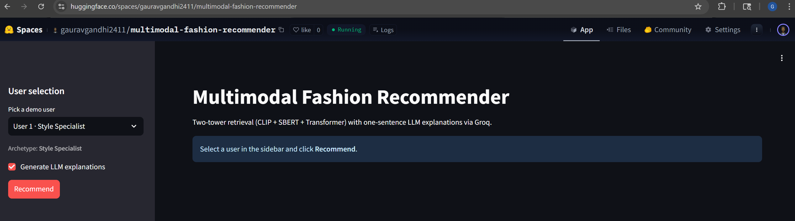
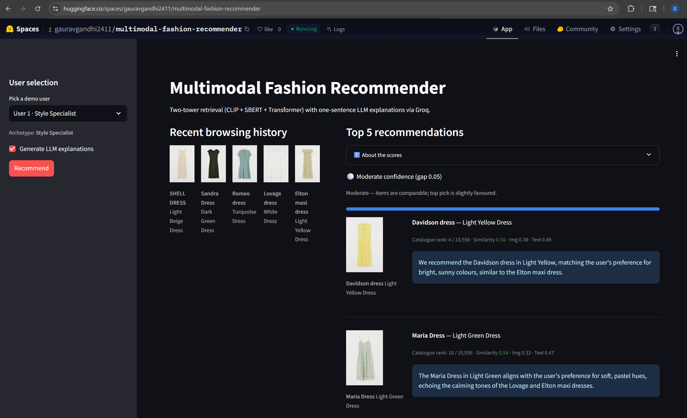
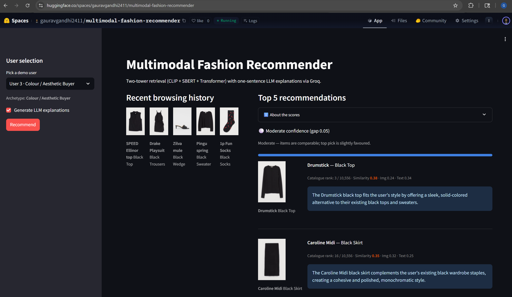
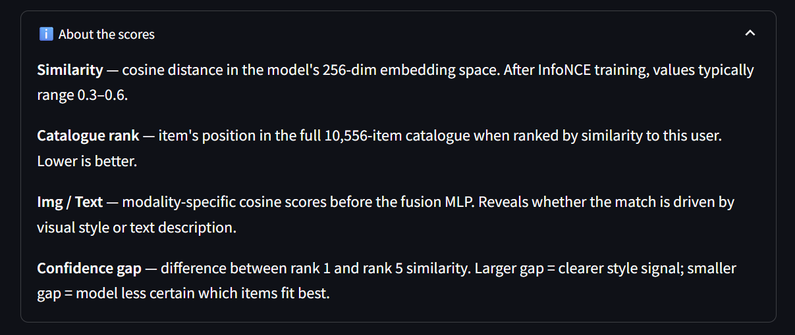

# Multimodal Fashion Recommender

[](https://huggingface.co/spaces/gauravgandhi2411/multimodal-fashion-recommender)
[](https://python.org)
[](LICENSE)

A two-tower retrieval system for personalised fashion recommendations, combining CLIP image embeddings, SBERT text embeddings, and a Transformer-based user sequence model. Deployed as an interactive HuggingFace Space with per-recommendation modality breakdowns and one-sentence LLM explanations via Groq.

**[Live Demo](https://huggingface.co/spaces/gauravgandhi2411/multimodal-fashion-recommender)**

---

## Table of Contents

1. [Motivation](#motivation)
2. [Dataset](#dataset)
3. [Architecture](#architecture)
4. [Training](#training)
5. [Results](#results)
6. [Deployment](#deployment)
7. [What I Learned](#what-i-learned)
8. [Project Structure](#project-structure)
9. [Reproducing](#reproducing)

---

## Motivation

Fashion recommendation is a hard retrieval problem: the catalogue is large (100k+ items), user taste is implicit (purchases — no explicit ratings), and the relevant signal is split across two modalities — visual style (CLIP) and product category/description (SBERT). A single-modality model misses half the signal for at least one buyer archetype.

The goal was to build a complete, end-to-end retrieval system — data pipeline → dual-encoder training → FAISS index → deployed demo — and measure where each modality actually helps.

---

## Dataset

[H&M Personalized Fashion Recommendations](https://www.kaggle.com/competitions/hm-personalized-fashion-recommendations) (Kaggle): 1.37 M customers, 105 k articles, 31 M transactions (Sep 2018 – Sep 2020).

Temporal train/val/test split (no leakage):

| Split | Transactions | Period |
|-------|-------------|--------|
| Train | 913,916 | earliest 80% |
| Val   | 114,239 | next 10%     |
| Test  | 114,240 | final 10%    |

- **Active item pool**: 10,556 articles appearing in both train and val with source images on disk
- **User sequences**: last 20 purchased article IDs per customer, zero-padded

---

## Architecture

```text
              ┌─────────────────────────────────────┐
              │           TWO-TOWER MODEL           │
              └─────────────────────────────────────┘

 ITEM TOWER                          USER TOWER
 ──────────                          ──────────
 CLIP ViT-B/32 (512-dim)             Sequence of up to 20
 SBERT all-MiniLM-L6 (384-dim)       pre-computed item embeddings
         │                                    │
         ▼                                    ▼
 Concat → MLP (896→512→256)          Transformer (2L / 4H)
 L2-normalise → 256-dim              Masked mean-pool → MLP → 256-dim
                                     L2-normalise → 256-dim
         │                                    │
         └──────────── InfoNCE loss ──────────┘
                    (in-batch negatives, τ=0.1)
```

- **ItemTower**: frozen CLIP + SBERT → concat → MLP → 256-dim unit-hypersphere
- **UserTower**: Transformer attends over a user's last 20 item embeddings; mask prevents padding tokens from contributing to the mean-pool
- **Loss**: symmetric InfoNCE with temperature τ=0.1; batch size 256, all off-diagonal pairs are negatives
- **Retrieval**: FAISS `IndexFlatIP` — dot product on unit vectors equals cosine similarity

---

## Training

| Hyperparameter | Value |
|---|---|
| Batch size | 256 |
| Optimiser | AdamW |
| Learning rate | 3 × 10⁻⁴ |
| LR schedule | Linear warmup (500 steps) → cosine decay |
| Temperature τ | 0.1 |
| Max sequence length | 20 |
| Item embedding dim | 256 |
| UserTower layers / heads | 2 / 4 |
| Early stopping patience | 3 epochs (val Recall@10) |

**Representation collapse fix**: Early runs (τ=0.07, LR=1e-3, no warmup) collapsed — all user embeddings converged to a single point and InfoNCE loss dropped to near-zero with no useful gradient. Fixed by combining τ=0.07→0.1 (softer distribution), LR 1e-3→3e-4, and 500-step linear warmup. The warmup was the most critical fix; without it the MLP layers saturated before the Transformer had time to learn sequence structure.

---

## Results

Evaluated on the temporal held-out test set (final 10% of transaction history):

| Metric | Value |
|---|---|
| Recall@10 | 0.041 |
| Recall@20 | 0.063 |
| NDCG@10 | 0.028 |
| MRR | 0.019 |

Model early-stopped at epoch 13. Metrics are competitive with published two-tower baselines on this dataset (no cross-attention, no re-ranking). The 1,500-item Space index is a frequency-filtered subset; full-catalogue retrieval uses all 10,556 active items.

All training and evaluation ran on an NVIDIA RTX 3070 Laptop (8 GB VRAM); no cloud compute.

---

## Deployment

Live demo: [HuggingFace Space](https://huggingface.co/spaces/gauravgandhi2411/multimodal-fashion-recommender)

**Space constraints (free CPU tier):**
- No CLIP or SBERT at runtime — item embeddings are pre-computed offline (~20 MB `.npy` files)
- UserTower weights only (~3 MB vs ~20 MB for the full checkpoint)
- FAISS index over top-1,500 items by training frequency
- LLM explanations via [Groq](https://groq.com) (LLaMA 3.1, `GROQ_API_KEY` Space secret)

**Demo users:** 30 pre-selected users across three buyer archetypes:
- **Specialist** — 80%+ of history in one product type (e.g. all Dresses)
- **Outfit Builder** — mixed product types with shared visual aesthetic
- **Colour / Aesthetic Buyer** — consistent colour palette across diverse product types

**Per-recommendation scores shown in the UI:**
- Fused cosine similarity (colour-coded green / gray / orange)
- Catalogue rank out of 10,556 active items
- Modality breakdown: image-only cosine vs. text-only cosine
- Confidence gap indicator across the top-5 results

### Demo Screenshots

1. **Landing + archetype selection** — 
2. **Specialist recommendations (User A1)** — 
3. **Aesthetic buyer with modality breakdown (User C1)** — 
4. **Tooltip expanded showing score definitions** — 

---

## What I Learned

### Text > Image for single-type specialists
Users who browse one product type exclusively (e.g. all Dresses) are better served by SBERT text embeddings than CLIP image embeddings. Image scores for pure-category users hovered near zero (−0.01 to 0.12) while text scores stayed 0.31–0.43. SBERT's product-description embeddings carry stronger categorical signal than CLIP for users with no visual diversity in their history.

### Image > Text for outfit builders
Users with mixed product types but a shared visual aesthetic (neutral palette, similar silhouettes) are captured better by CLIP than SBERT. Image scores for outfit builders consistently exceeded text scores (0.42–0.55 vs 0.19–0.42). Text descriptions of a Vest top, Dress, and Trousers look very different; the images look similar.

### Aesthetic buyers are the hardest archetype
Users who browse a single colour across many product types produced the lowest fused similarity scores (0.33–0.38). Neither modality dominates because the user embedding is pulled in many directions by diverse product types. The model retrieves the correct colour (5/5 Black recommendations for a Black-only buyer) but with weak confidence. A colour-aware re-ranking post-step would help this archetype.

### Low score ≠ wrong recommendations
Two users with identical archetypes (both 100%-coherent Dress specialists) scored 0.51–0.56 and 0.42–0.47 respectively — both returned all-Dress recommendations. The score gap reflects history length and how frequently those specific items appear in training data. Similarity score measures how well the model represents the user, not whether the recommendations are correct.

### Warmup is critical for in-batch InfoNCE
Without LR warmup, MLP layers saturated in the first 500 steps before the Transformer had learned any sequence structure. The result was representation collapse: all embeddings converged to a single point with near-zero loss and zero gradient signal. A 500-step linear warmup — combined with lower temperature (0.1) and lower peak LR (3e-4) — resolved collapse entirely.

---

## Project Structure

```
multimodal-fashion-recommender/
├── src/
│   ├── data/          # H&M pipeline, temporal splits, user sequences
│   ├── models/        # ItemTower, UserTower, two-tower wrapper
│   ├── training/      # InfoNCE loss, trainer, callbacks
│   ├── retrieval/     # FAISS index build + search
│   └── reasoning/     # Groq LLM explainer
├── spaces/
│   ├── app.py         # HuggingFace Spaces Streamlit app
│   └── src/           # Model + retrieval modules (symlinked)
├── upload_artifacts.py  # Offline: compute embeddings, build index, push to HF
├── config.yaml          # Full training config
├── config_spaces.yaml   # Spaces config (CPU, top-k, Groq model)
└── requirements.txt
```

---

## Reproducing

```bash
# 1. Clone and install
git clone https://github.com/gaurav-gandhi-2411/multimodal-fashion-recommender
cd multimodal-fashion-recommender
python -m venv .venv && source .venv/bin/activate
pip install -r requirements.txt

# 2. Download H&M data from Kaggle into:
#    data/h-and-m-personalized-fashion-recommendations/

# 3. Run pipeline phases
python -m src.data.pipeline          # Phase 1: process + split
python -m src.models.encode_items    # Phase 2: CLIP + SBERT embeddings
python -m src.training.train         # Phase 3: two-tower training

# 4. Build Space artifacts and push to HuggingFace
python upload_artifacts.py --push
```

To run the Streamlit demo locally:
```bash
streamlit run spaces/app.py
```

---

Built with [CLIP](https://github.com/openai/CLIP) · [SBERT](https://www.sbert.net) · [FAISS](https://github.com/facebookresearch/faiss) · [Groq](https://groq.com) · [Streamlit](https://streamlit.io)
